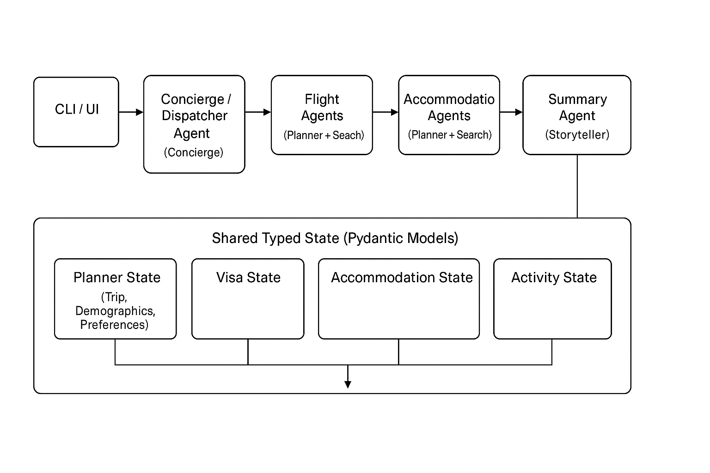
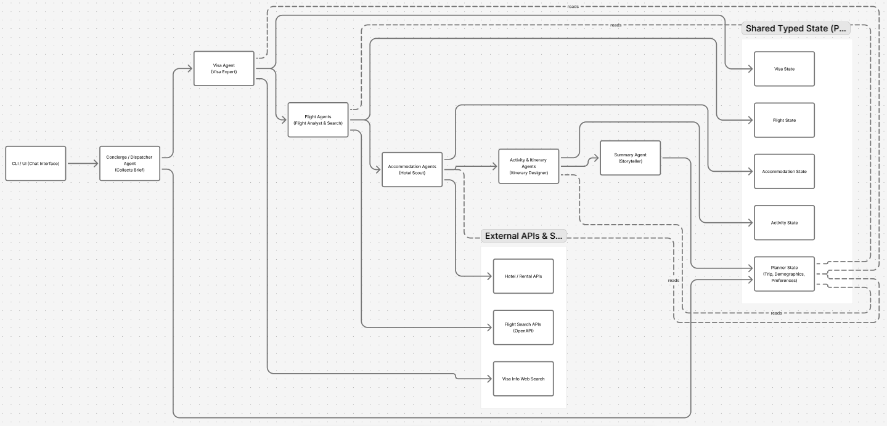

# Globe Tripper – AI Travel Concierge

Globe Tripper is an AI‑powered travel concierge that plans complex, mostly international trips by orchestrating a team of specialist agents over visas, flights, accommodation, and activities. It is built on top of the Google Agent Development Kit (ADK) and is designed as a reference implementation for multi‑agent planning, not just a single‑model chatbot.

For a business‑ and product‑focused narrative of why this exists and what opportunity it targets, see `about-this-agent.md`.

<!--  -->

---

## What Globe Tripper Does

At a high level, Globe Tripper:

- Acts as a **conversational concierge**, collecting trip details, traveler demographics, and preferences through natural language intake.  
- Runs a **parallel planning pipeline** to reason about visas, flight options, accommodation, and activities in a coordinated way.  
- Uses **specialized agents** for each domain (visa, flights, hotels, activities, etc.) that talk to tools and external APIs.  
- Produces a **coherent, user‑facing trip summary** that explains feasible routes, constraints, and recommended options.

The current focus is international leisure travel (e.g., “family trip from Lagos to London”), where visa and routing complexity make automation especially valuable.

For a concrete example of what the end‑to‑end output looks like (including a multi‑day family itinerary, visa‑aware date adjustments, and cost estimates), see `docs/flows/intake-to-summary.md`.

---

## Architecture Overview



Globe Tripper is structured as a small agentic system with shared state and orchestration:

- **Intake / Concierge layer**
  - `dispatcher_agent` (`src/agents/dispatcher_agent.py`) – first‑line intake agent. Talks to the user, calls tools like `update_trip_plan`, `resolve_airports`, and `mark_ready_for_planning`, and decides when intake is “good enough” to move into planning.

<!-- - **Planning layer**
  - `planner_root_agent` & `parallel_planner_agent` (`src/agents/parallel_planner_agent.py`) – orchestrators.  
    - `planner_root_agent` is a coordinator agent that calls other agents as tools.  
    - `parallel_planner_agent` is a `ParallelAgent` that runs multiple domain agents concurrently (currently visa + flights, with room to add more). -->

- **Domain specialist agents**
  - `visa_agent` (`src/agents/visa_agent.py`) – derives visa requirements and visa search tasks based on planner state, then applies search results back.  
  - `flight_agent`, `flight_search_agent`, `flight_search_tool_agent` (`src/agents/flight_agent.py`, `src/agents/flight_search_agent.py`) – derive flight search tasks, call Google Flights tools, normalize and apply results.  
  - `accommodation_agent`, `accommodation_search_agent`, `accommodation_search_tool_agent` (`src/agents/accommodation_agent.py`, `src/agents/accommodation_search_agent.py`) – derive hotel/short‑stay search tasks, call accommodation tools, and choose options.  
  - `activity_agent` and related itinerary/search/apply agents (`src/agents/activity_agent.py`) – plan day‑level activities and build a day‑by‑day itinerary.  
  - `search_agent` & `visa_result_writer_agent` (`src/agents/search_agent.py`) – generic web search + visa result writer.  
  - `bureaucracy_agent` (`src/agents/bureaucracy_agent.py`) – specialized for long‑form visa/bureaucratic text.  
  - `trip_summary_agent` (`src/agents/summary_agent.py`) – turns the consolidated state into a concise, user‑friendly trip summary.

- **Shared state**
  - Typed state models live in `src/state`:
    - `planner_state.py` – trip details, traveler demographics, preferences, planner status.  
    - `visa_state.py`, `flight_state.py`, `accommodation_state.py`, `activity_state.py` – domain‑specific search tasks, results, and choices.  
    - `state_utils.py` – helpers to read/write the above from the session.

- **Tools and external APIs**
  - `src/tools/tools.py` – core tools used by agents (update planner state, derive visa & flight tasks, read/write domain search state, etc.).  
  - `src/tools/planning_tools.py` – planning‑related helpers such as `mark_ready_for_planning`.  
  - OpenAPI specs for external APIs live in `src/tools/*.yaml` (e.g., Google Flights, Airbnb‑like accommodation APIs); these are consumed by tool‑only agents.

- **Configuration and prompts**
  - `src/config/agents.yaml` – controls which LLM/provider each agent uses (e.g., Gemini models for dispatcher, visa, flights, search).  
  - `src/artifacts/*/instruction.md` – per‑agent instruction files (dispatcher, planner, visa, etc.), including `src/artifacts/planner/instruction.md` for the planning orchestrator.

The code in `run.py` ties these pieces together into runnable pipelines (both interactive and debug).

---

## Repository Layout

- `run.py` – main entry point, containing:
  - `main()` – an interactive CLI concierge that talks to `dispatcher_agent` and triggers planning as intake completes.  
  - `debug_parallel_planner()` – a pipeline that seeds a sample trip plus stubbed search results, then runs the planner and summary agents end‑to‑end for debugging.
- `src/agents/` – all agents (dispatcher, planner, visa, flights, accommodation, activities, search, summary, bureaucracy).  
- `src/state/` – Pydantic models for planner, visa, flights, accommodation, and activities.  
- `src/tools/` – tools and API specs used by agents.  
- `src/artifacts/` – instruction prompts and other agent artifacts.  
- `src/config/agents.yaml` – provider/model configuration for each agent.  
- `tests/` – unit tests and evaluation scenarios.  
- `about-this-agent.md` – higher‑level product and business justification for the concierge.  
- `LICENSE` – MIT license.

---

## Getting Started

### Prerequisites

- Python `3.10+`.  
- [Poetry](https://python-poetry.org/) for dependency management.  
- API credentials for the LLM provider(s) you configure in `src/config/agents.yaml` (e.g., Gemini / Google GenAI, OpenAI).  
- Any additional API keys needed by your configured tools (e.g., `GOOGLE_API_KEY` for Google Flights/Hotels via SearchAPI or similar).

### Installation

```bash
git clone <this-repo>
cd globe_tripper
poetry install
```

Create a `.env` file (or set environment variables) with the credentials required by `google-adk` and your chosen providers. For example:

```bash
GOOGLE_API_KEY=your_google_api_key_here
OPENAI_API_KEY=your_openai_api_key_here
```

Then adjust `src/config/agents.yaml` to point each agent at the provider/model combination you want (by default, many agents use Gemini models).

---

## Running the Concierge

There are two main ways to run the system from `run.py`:

### 1. Interactive CLI Concierge (recommended for demos)

This mode lets you chat with Globe Tripper as a concierge from your terminal.

1. Open `run.py` and in the `if __name__ == "__main__":` block:
   - Uncomment `asyncio.run(main())`.  
   - Comment out `asyncio.run(debug_parallel_planner())`.
2. Run:

```bash
poetry run python run.py
```

You’ll see a greeting from Globe Tripper and can start typing messages like “Family of 3 traveling from Lagos to London in August” and refine from there. The intake dispatcher will:

- Ask follow‑up questions until planner state is sufficiently populated.  
- Mark the planner as ready (`status == "planning"`).  
- Trigger the visa, flight, accommodation, and activity pipelines in the background.  
- Eventually allow downstream agents to summarize the full plan.

### 2. Debug Parallel Planner Pipeline

By default, the `__main__` block is wired to:

```python
asyncio.run(debug_parallel_planner())
```

This mode:

- Seeds a sample trip state (planner, visa, flights, and accommodation).  
- Runs the visa + flight planning and search pipelines, then the activity pipeline.  
- Ends by generating a detailed trip summary via `trip_summary_agent`.  
- Prints intermediate state to the console so you can see how agents update `VisaState`, `FlightState`, `AccommodationState`, and `ActivityState`.

Use this when you want to inspect how the parallel planner behaves end‑to‑end without going through the conversational intake.

---

## Testing

To run the test suite:

```bash
poetry run pytest
```

There are two main groups:

- `tests/unit/` – unit tests for core state utilities and planner logic.  
- `tests/evals/` – scenario‑based evaluations for the intake and planning behavior.

---

## Documentation & Next Steps

- **High‑level overview**  
  - `about-this-agent.md` – narrative about the opportunity, problem space, and why a concierge‑style agentic system makes sense.

- **Technical docs (current)**  
  - `docs/overview.md` – short architectural overview and concept glossary.  
  - `docs/agents/README.md` – index of all agents with one‑line descriptions, linking to:
    - `docs/agents/dispatcher.md` – intake concierge.  
    - `docs/agents/planner.md` – root planner and parallel planner.  
    - `docs/agents/visa.md` – visa specialist.  
    - `docs/agents/flight.md` – flight planning and search agents.  
    - `docs/agents/accommodation.md` – accommodation planning and search agents.  
    - `docs/agents/activity.md` – activity and itinerary agents.

- **Nice‑to‑have future docs**  
  - `docs/tools/` – main tools in `src/tools/tools.py` and `src/tools/planning_tools.py`, including expected arguments and state mutations.  
  - `docs/flows/` – end‑to‑end flows such as “intake → planning → summary,” visa pipeline, flight pipeline, accommodation pipeline, and activity pipeline.

---

## License

Globe Tripper is released under the MIT License. See `LICENSE` for details.
